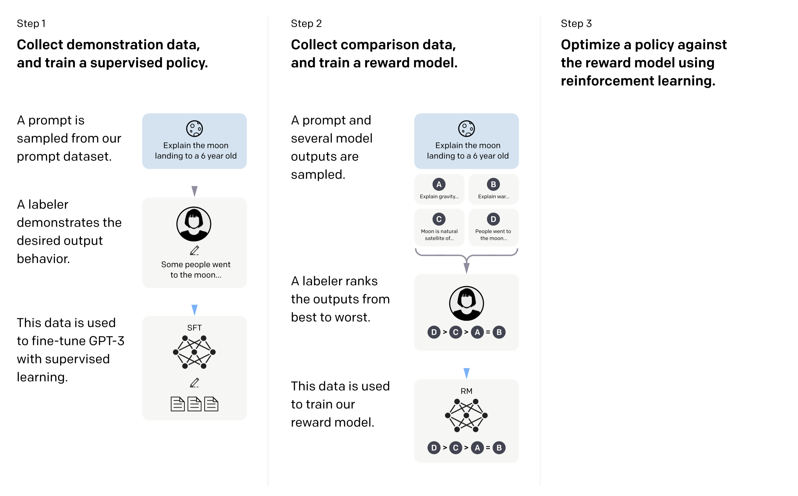

这篇文章总结InstructGPT中的一些要点。

主要使用的技术是Reinforcement learning from human feedback (RLHF)

## Dataset

prompt数据来自于两种方式：

1. 标注工（labeler）写的问题+答案 (prompt + completion)
2. 根据前面的数据生成一个模型后放在社区playground上给大家使用，把大家的问题记录下来。按照User ID划分训练和测试集。

通过这些prompt，我们得到了3中不同的数据集：

1. SFT (supervised fine-tuning) dataset，人工写的问题+答案。样本数量13k
2. RM (reward model) dataset，标注工给生成的多个答案排序，以此训练出另一个模型（reward model）。样本数量33k
3. PPO dataset，任何用户的输入。样本数量31k

## Model

#### Supervised fine-tuning (SFT)

用GPT3去fine-tune上面标注的数据，训练16个epoch。其实在训练1个epoch之后就出现了过拟合，但是实验发现更多的epoch可以对RM分数和人类打分都有提升。

#### Reward Model (RM)

把SFT模型中的最后一层unembedding layer去掉（softmax输出概率，这一层去掉），改成输出一个标量scalar reward作为奖励值。这里使用的是一个6B参数的RM模型，实验发现175B的模型不太稳定。

loss function是一个pairsize ranking loss:

$$
\text{loss}(\theta)=-\frac{1}{k\choose 2}E_{(x,y_w,y_l)\sim D}[\log (\sigma(r_\theta(x,y_w))-\sigma(r_\theta(x,y_l)))]
$$

其中$r_\theta(x,y)$是RM对于prompt $x$和completion $y$ 的输出标量，$y_w$ 是在pair $(y_w, y_l)$ 中评分更高的completion，$\sigma$ 是sigmoid函数。

最小化loss即最大化 $\sigma(r_\theta(x,y_w))-\sigma(r_\theta(x,y_l))$的值。

实验中K的取值为9，即在9个y中两两比较，一共有36对

#### Reinforcement Learning (RL)

实验采用了PPO算法 (Schulman et al., 2017)

maximize following combined objective function in RL training:

$$
\text{objective}(\phi)=E_{(x,y)\sim D_{\pi_\phi^\text{RL}}}\left[r_\theta(x,y)-\beta\log\left(\frac{\pi_\phi^\text{RL}(y|x)}{\pi^\text{SFT}(y|x)}\right)\right] + \gamma E_{x\sim D_\text{pretrain}}[\log(\pi_\phi^\text{RL}(x))]
$$

其中$\pi_\phi^\text{RL}$ 是要学习的模型（RL policy），$\pi^\text{SFT}$ 是SFT训练出来的模型。注意与统计学习不同的是，**强化学习的数据分布会随着模型的变化而变化**。

$r_\theta$ 实际上是在学习人类的排序，来给RL提供一个实时的反馈。

$\beta$ 是KL系数，这一项是RL模型概率分布和SFT模型概率分布的KL散度（用于评估RL和SFT模型分布的分离程度），这是一个正则项（或者说惩罚项penalty），用于约束模型使得RL模型与SFT的分布偏差不要过大。

$\gamma$ 这一项使得模型能够同时参考pretrain的原始数据。如果$\gamma=0$，则模型被称为PPO模型，如果$\gamma\ne0$，则模型被称为PPO-ptx模型
